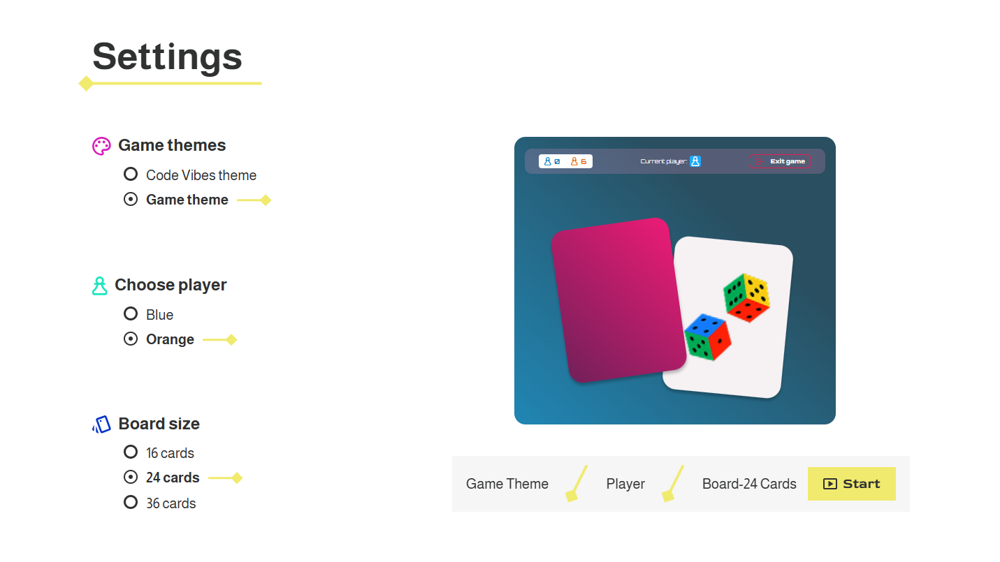
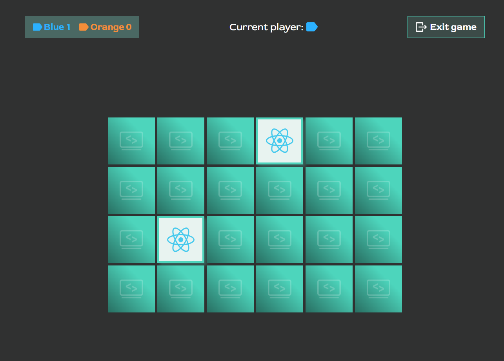

# Memory Game

A small browser-based memory game built with TypeScript, Vite, and SCSS. Players can choose a theme, board size, and player color before starting a two-player match.

## Preview

- 
- 

## Quick Start

```bash
git clone https://github.com/AnnikaEgger/memory
cd memory
npm install
npm run dev
```

Open the local Vite URL in your browser to start playing.

## Key Features

- Two-player memory gameplay
- Theme selection for different visual styles
- Adjustable board sizes
- Score tracking and winner display
- Persistent settings with local storage

## Tech Stack

- TypeScript
- HTML5
- SCSS
- Local Storage
- Vite

## Project Structure

```text
memory/
├── html/
│   ├── endscreen.html
│   ├── game.html
│   └── settings.html
├── public/
│   └── assets/
├── src/
│   ├── main.ts
│   ├── scss/
│   └── ts/
│       ├── models/
│       ├── data.ts
│       ├── game.ts
│       ├── settings.ts
│       └── game-config.ts
├── package.json
├── tsconfig.json
└── vite.config.ts
```
